# GLIMMER_CS_EASY_3
微光招新题03

## step1

1. 

（1） 树是任意节点可以分出若干个子节点，但是只有一个根节点，长得像倒着的树一样的非线性数据结构（1对多）
|术语|	含义|
|---|------|
|根节点 (Root)|	树的起始节点，没有父节点|
|子节点 (Child)|	某个节点直接连接的下一层节点|
|父节点 (Parent)|	某个节点直接连接的上一层节点|
|叶节点 (Leaf)	|没有子节点的节点，即树的末端|
|深度 (Depth)	|从根节点到该节点的边数，根的深度为 
|高度 (Height)	|从该节点到最深叶节点的边数|

（2）二叉树
每个节点的度最多只能是**2**，也就是最多 2 个子节点。
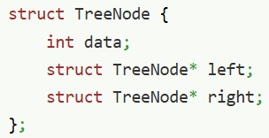
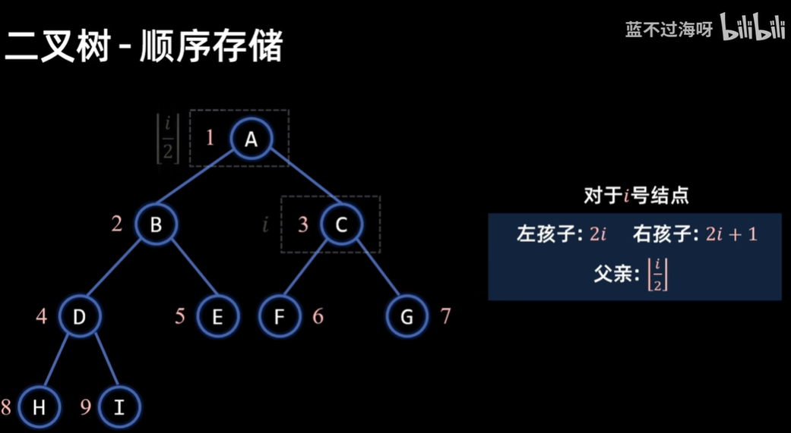
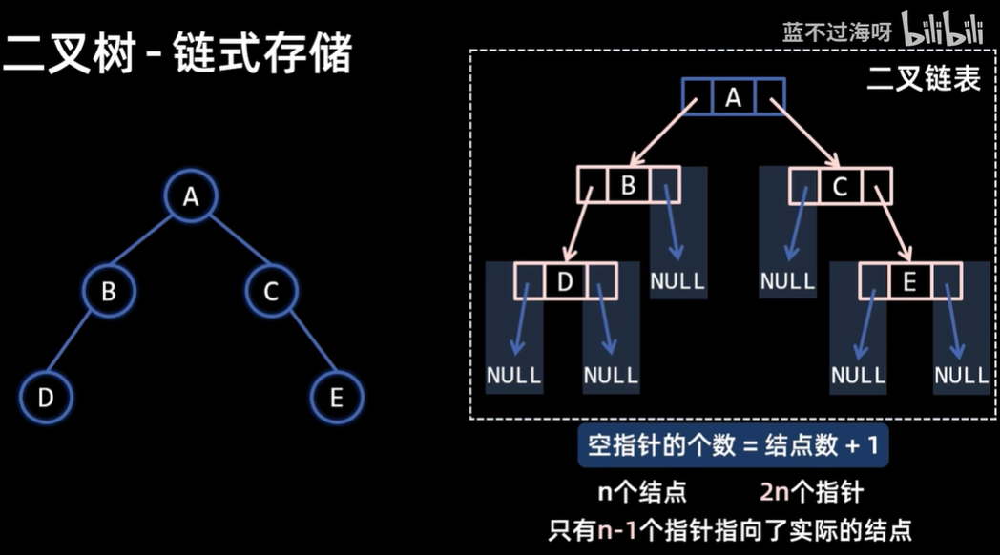

2. 
二叉树有和链表数组类似的存储方式，既可以顺序存储，也可以动态链式存储，but
顺序存储一般常用于完全二叉树等较满的树（非完全二叉树为了保留二叉树的下标规律，存储时用其他无关数据虚构补满为完全二叉树，但是这样会对空间造成很多浪费啊，特别是全部长右边的！怎么办呢，使用链式存储吧）

（2）链式存储时：空指针的个数=节点数+1

     顺序存储的下标也有规律，如前面的图（注意！！数组空一个0，索引规律更简单）

 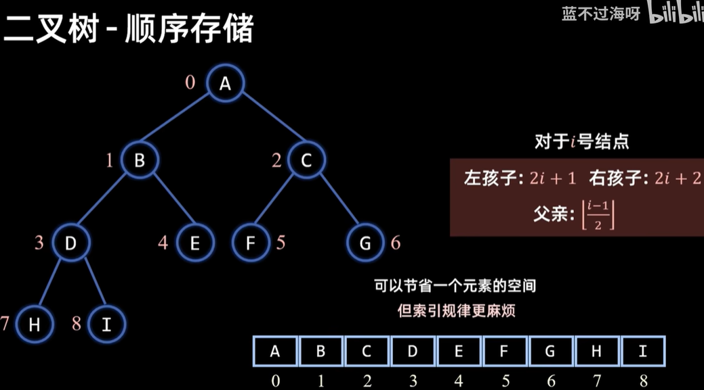

3. 顺序存储的代码补全的思考过程
- 阅读提供的代码时了解到匿名结构体，可以少打几个字，只有一个缺点是不能在结构体内部自引用，但是反正这是顺序存储也用不到wo
- 传入指针如果在函数内部为遍历做了改变的要在一开始设置一个新变量接住
  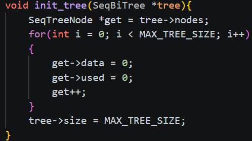
   
   写完第一个我才想起来用下标啊！！！太瓜了maybe我太困了
- 第一遍写完让ai检查总结

(1)忘记了初始化时`tree->size=MAX_TREE_SIZE;`没注意到这还有个变量size,要把MAX赋值给它吗，其实感觉影响不大，直接用这个max应该也可以 吧

(2)写完了突然想起来c是不是不能用0和1，问了ai才发现头文件已经有配置了可以写，之前不知道这个头文件
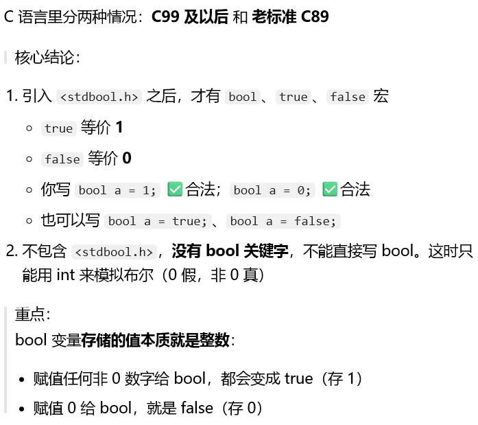
(3)忘记了max的边界检查，只判断了父母节点
- 顺便问了一下ai有没有其他写法，ai告诉我还可以写队列，后面再学吧

## step2
- 我努力建了这棵树，但是感觉我建的很弱智，一直写重复的代码；中间没遇到什么问题，也没有问ai，毕竟我这个写的屎一样，最后让ai帮我检查了一下没问题

## step3

ps:图片来自菜鸟驿站
- 大概理解这几个遍历是什么意思后，我觉得先自己想想，不看代码实例

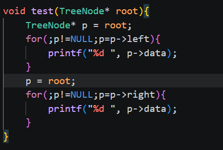

i try,but i fail乱写了一通；我想设一个变量暂存亲节点，但是搞不对，我不知道怎么整了，直接看菜鸟教程的示例代码吧
- return----结束这次函数的调用

这个太巧妙了，可以终止返回上一个函数，我之前都不知道这个return的完全含义

当我自己举例尝试时，感觉有点没懂当一个节点为叶结点时函数为什么不会直接结束，于是和ai进行交流，明白了上一个函数只是被暂停，而不是终止了
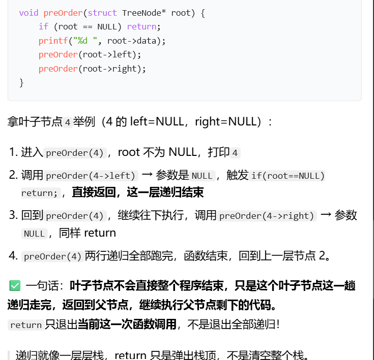
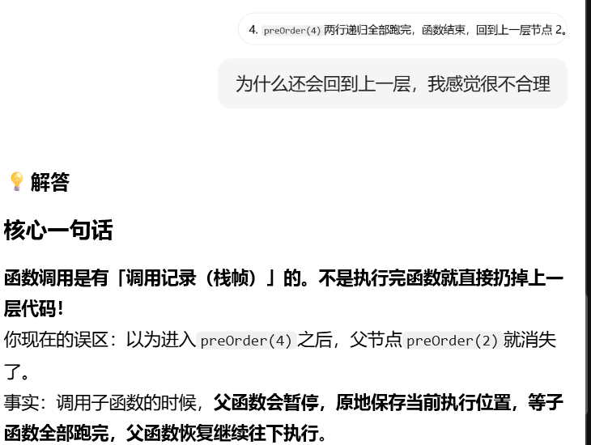
- 递归---递进回归，先递进再回归
想要理解递归，你需要先理解递归，再理解递归……直到你能理解递归

前序遍历和中序遍历都是一路找到最左边的节点，但是前序print在前面，所以相当于路上顺便先打印根，而中序遍历是找到最边上的节点后再倒回来一步步打印
- 前序遍历为例的递归过程（ai总结，ai写的很好，我表达没那么清楚，已经理解）
1. **调用 preOrder (1)**
   - root 不为 NULL，打印 `1`
   - 执行 `preOrder(1->left)` → 调用 `preOrder(2)`
   ✅ preOrder(1) **暂停**，等待 preOrder (2) 返回
2. **进入 preOrder (2)**
   - root 不为 NULL，打印 `2`
   - 执行 `preOrder(2->left)` → 调用 `preOrder(4)`
   ✅ preOrder(2) **暂停**，等待 preOrder (4) 返回
3. **进入 preOrder (4)**
   - root 不为 NULL，打印 `4`
   - 执行 `preOrder(4->left)` → 4 左孩子是 NULL，触发`return`，这一行结束
   - 执行 `preOrder(4->right)` → 4 右孩子是 NULL，触发`return`，这一行结束
   - preOrder (4) 全部代码跑完，**return**
   ✅ 回到暂停的 preOrder (2)，继续执行下一行：`preOrder(2->right)` → 调用`preOrder(5)`
4. **进入 preOrder (5)**
   - root 不为 NULL，打印 `5`
   - preOrder (5->left)：NULL 直接 return
   - preOrder (5->right)：NULL 直接 return
   - preOrder (5) 结束，return
   ✅ 回到 preOrder (2)，preOrder (2) 两行递归都执行完，return
   ✅ 回到暂停的 preOrder (1)，继续执行下一行：`preOrder(1->right)` → 调用`preOrder(3)`
5. **进入 preOrder (3)**
   - root 不为 NULL，打印 `3`
   - 执行 `preOrder(3->left)` → 调用`preOrder(6)`
   ✅ preOrder (3) 暂停
6. **进入 preOrder (6)**
   - root 不为 NULL，打印 `6`
   - 左右都是 NULL，两次调用直接 return
   - preOrder (6) 结束 return
   ✅ 回到 preOrder (3)，继续执行下一行 `preOrder(3->right)` →调用 preOrder (7)
7. **进入 preOrder (7)**
   - root 不为 NULL，打印 `7`
   - 左右都是 NULL，两次调用直接 return
   - preOrder (7) 结束 return
   ✅ 回到 preOrder (3)，preOrder (3) 全部执行完，return
   ✅ 回到 preOrder (1)，preOrder (1) 全部执行完毕，遍历结束

`1` → `2` → `4` → `5` → `3` → `6` → `7`

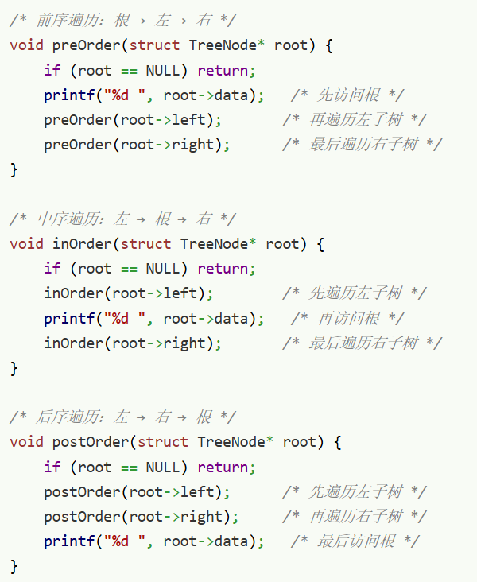

往下滑我就看到了菜鸟的建树过程

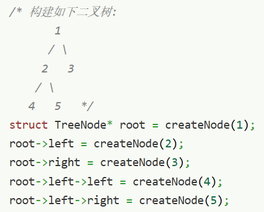

？？？原来可以连着写吗

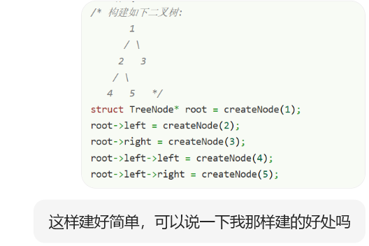
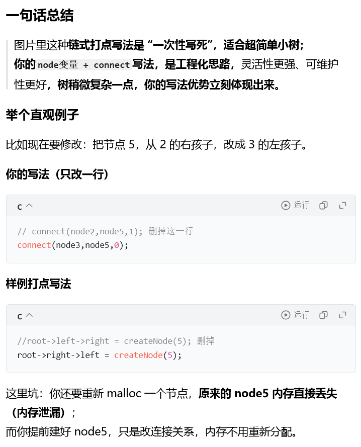
说的太好了

### int depth(TreeNode *root, int current_depth, int max_depth)

除了我写的低智函数，了解到
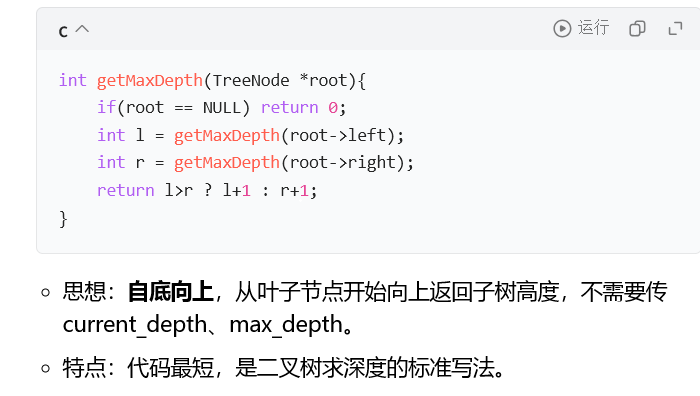
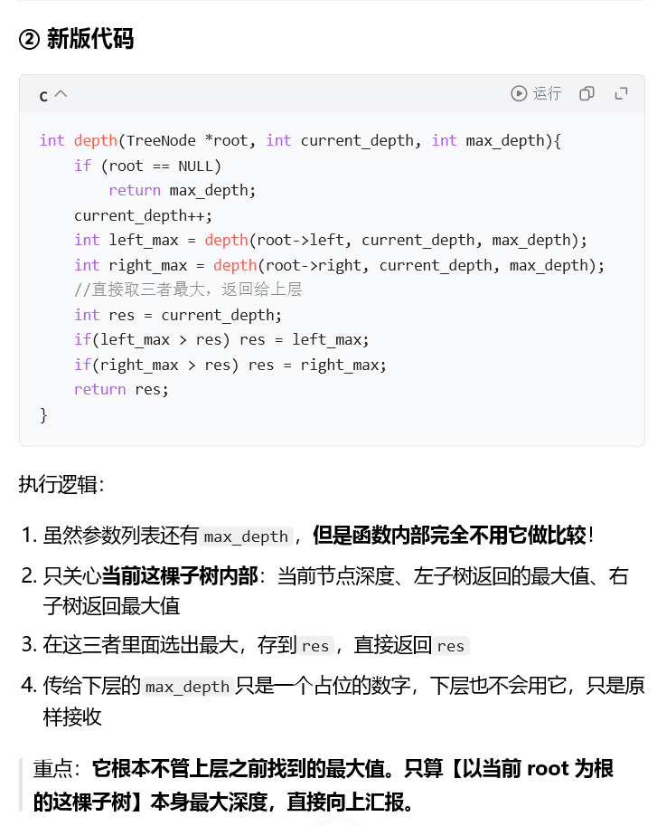
还有一个理论上可以不用这个max参数的版本

- 循环和递归的感悟
因为题目提到了相似之处，查了一下二叉树遍历可以全用循环实现吗，真的可以！！！
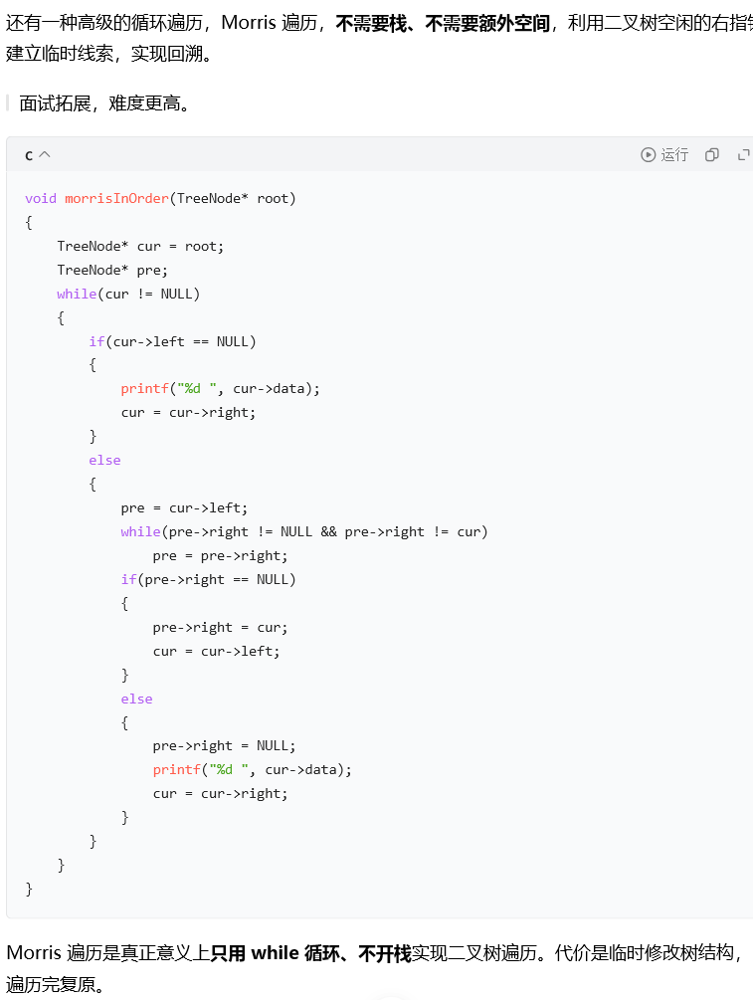

所以递归和循环可以互相转换吧，都需要终止条件，只是递归回去更方便 吧
but递归内存开销大,感觉只能少量的数据适合用

### 栈
**「后进先出 LIFO」的数据结构。**

> 
> Last In First Out：最后放进去的元素，最先拿出来。

- 数组的代码封装实现

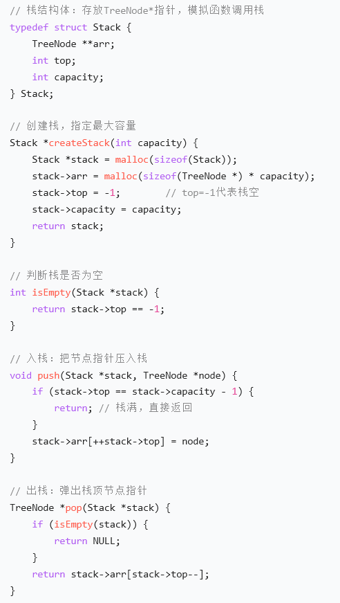

（ai生成的总结）
1. **参数**：本次调用传进去的值，比如`factorial(5)`栈帧里就存 n=5；`factorial(4)`栈帧存 n=4
2. **局部变量**：这个函数内部定义的变量，每个栈帧局部变量独立，互不影响
3. **返回地址**：记录函数执行完之后，回到代码哪一行继续运行。
> 
> 比如`factorial(5)`调用`factorial(4)`，`factorial(5)`的栈帧会记下：等 factorial (4) 算完，回到这一行继续计算。
4. **寄存器旧值**：CPU 寄存器在调用子函数前保存的现场，函数返回后恢复。

factorial是阶乘函数

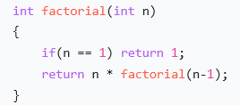

- 往下递归的时候，不断新建栈帧，压入系统栈。当达终止条件后原路返回，栈帧依次销毁，出栈
- 系统调用栈（函数栈）：就是保存函数栈帧的那块内存，**容量很小**（一般几 MB，Windows 默认 1MB 左右，Linux 默认 8MB），是操作系统预先分配好固定大小。
 用`malloc`在堆上写的数组栈和链表栈（二叉树遍历那个），属于堆内存，空间大很多，一般不容易栈溢出。
- **前置自增 `++var`**

 **先加，后用**
   
    先把变量的值 +1
    **然后返回增加之后的新值**

-  **后置自增 `var++`**

 **先用，后加**
   
    先返回变量**原来的旧值**
   
    表达式执行结束后，变量再 +1

第一遍写的有问题且丑陋，ai大人帮我进行了修改
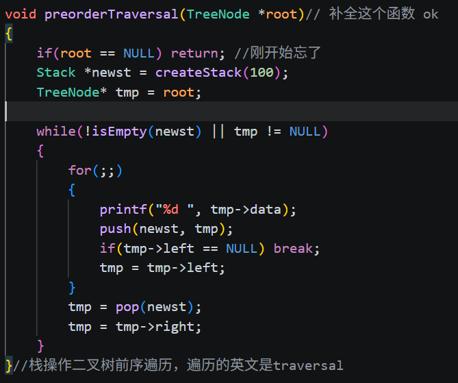
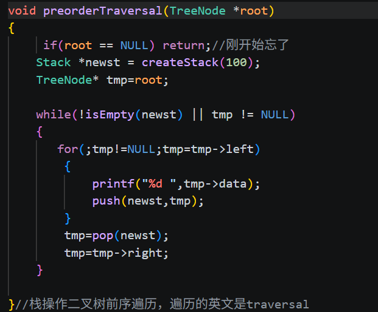
